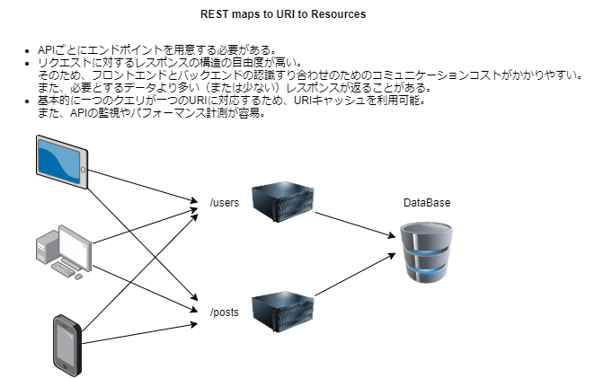
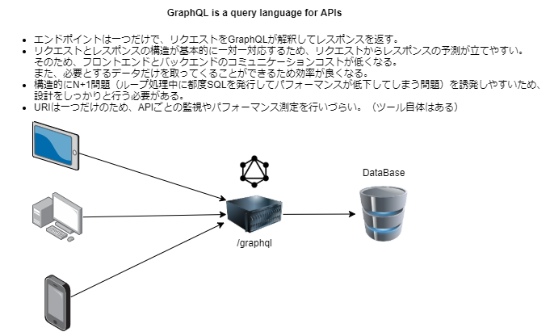
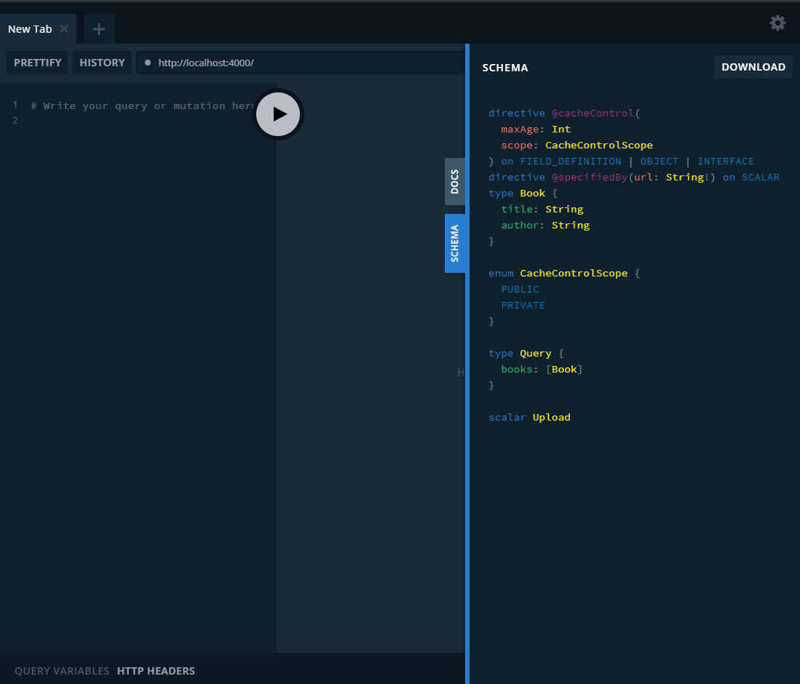
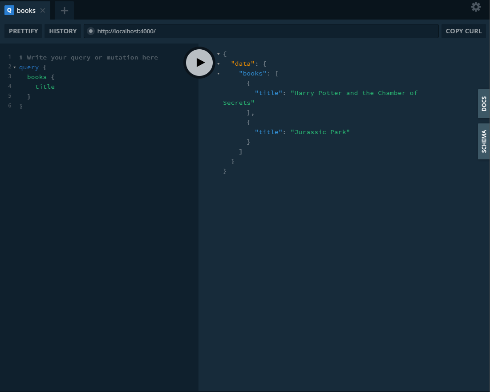
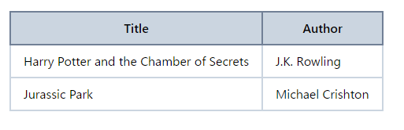

# GraphQL

## GraphQL と REST API

- 参考
    - [GraphQLを導入してみて得た知見と雑感。GraphQLはタイタニックの救命ボードになりえるかも](https://qiita.com/jabba/items/0bf3d2436215394391a7)
    - [「GraphQL」に移るべき人、「REST」を使い続けるべき人を分ける条件](https://techtarget.itmedia.co.jp/tt/news/2002/10/news04.html)
    - [REST APIが主流のプロジェクトの中でGraphQLを導入してみた話（サーバーサイド編）](https://buildersbox.corp-sansan.com/entry/2020/07/17/110000)

GraphQLはAPIを定義するためのクエリ言語・仕様

そのメリットを一言で言えば **クライアント＝サーバー間での複雑なトランザクション処理の全てをGraphQLが吸収してくれる** こと

### REST API


### GraphQL


***

## Apollo Server による GraphQL 実装

### Environment
- Editor: `VSCode`
- Shell: `bash`
- Node.js: `12.18.2`
    - Yarn package manager: `1.22.4`

### Setup
```bash
# install apollo-server, graphql-tag
# $ yarn add apollo-server graphql-tag

# install node_packages from package.json
$ yarn
```

### server.js
```javascript
/**
 * Apollo Server + GraphQL
 * $ node server.js
 */
const {ApolloServer, gql} = require('apollo-server')

/**
 * スキーマ定義
 * @type Book: title, author 文字列カラムを持つデータ構造
 * @type Query: GraphQL で処理するクエリ
 *    - booksクエリ: Bookデータの配列を返す
 */
const typeDefs = gql`
  type Book {
    title: String
    author: String
  }

  type Query {
    books: [Book]
  }
`

/**
 * 上記 Query で定義したクエリの実装
 */
const resolvers = {
  Query: {
    /**
     * booksクエリ: Bookデータの配列を返す（ここではJSON定数データを返す）
     */
    books() {
      return [
        {
          title: "Harry Potter and the Chamber of Secrets",
          author: "J.K. Rowling"
        },
        {
          title: "Jurassic Park",
          author: "Michael Crishton"
        }
      ]
    }
  }
}

/**
 * Apollo Server + GraphQL 起動
 * http://localhost:4000
 */
const server = new ApolloServer({typeDefs, resolvers})
server.listen(process.env.PORT || 4000).then(({url}) => {
  console.log(`🚀 Apollo Server: ${url}`)
})
```

#### Launch Server
```bash
$ node server.js

# => http://localhost:4000
```



#### Launch Query
GraphQLのクエリを渡すと、それに対応したレスポンスが返ってくる

例として、以下のようなクエリを渡すと本のタイトルのみ取得することができる

```
query {
  books {
    title
  }
}
```



上記クエリを JSON データの `query` に文字列として POST すると cURL を使ってもクエリを実行できる

```bash
$ curl -X POST -H 'Content-Type: application/json' -d '{"query": "query { books { title }}"}' http://localhost:4000

# => JSONデータが返る
# {"data":{"books":[{"title":"Harry Potter and the Chamber of Secrets"},{"title":"Jurassic Park"}]}}
```

***

## Nuxt.js クライアントから Apollo Server GraphQL への接続

### Setup
```bash
# install nuxt modules
# $ yarn add nuxt nuxt-purgecss postcss-import postcss-nested@^4.2.3 tailwindcss @nuxtjs/apollo apollo-cache-inmemory
$ yarn

# start servers
## start:frontend http://localhost:3000
## start:backend http://localhost:4000
$ yarn start
```

### pages/index.vue
```vue
<template>
  <section class="container">
    <table class="table-auto">
      <thead>
        <tr class="text-center bg-gray-400">
          <th class="border-2 border-gray-600 px-4 py-2">Title</th>
          <th class="border-2 border-gray-600 px-4 py-2">Author</th>
        </tr>
      </thead>
      <tbody>
        <tr v-for="(book, index) in books" :key="index">
          <td class="border-2 border-gray-400 px-4 py-2">{{book.title}}</td>
          <td class="border-2 border-gray-400 px-4 py-2">{{book.author}}</td>
        </tr>
      </tbody>
    </table>
  </section>
</template>

<script>
import gql from 'graphql-tag'

export default {
  data: () => ({
    books: [] // replace by apollo/graphql
  }),
  /**
   * @nuxtjs/apollo
   * - Get books query
   */
  apollo: {
    books: {
      query: gql`
        query {
          books {
            title, author
          }
        }
      `
    }
  }
}
</script>
```


