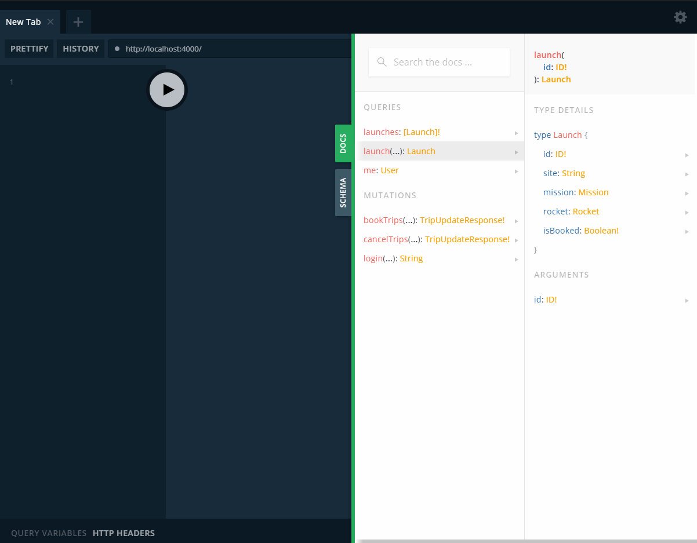

# Apollo GraphQL チュートリアル

## Schema 構築

- Graph API は Schema を中心につくられている
- Schema は設計図のようなもので GraphQL API で使用される全てのデータの型とそれらの関係性を示す
- Schema は Query を用いて取得できるデータがどのようなものか、Mutation を用いて更新できるデータがどのようなものか、ということも定義する
    - これらは全て strongly-typed であり、これによって強力な開発支援ツールの使用が可能となる
- Schema は、それを使用するクライアント側の必要性に基づいて設計をおこなうと本領が発揮される
    - Schema はクライアントとその背後にあるサービスの間に存在するため、フロントエンドチームとバックエンドチームが協業する際の中間地点として非常にうまく機能する
    - そのため **Schema First Development** というチーム開発手法がオススメ
        - API の開発をするより先に、まず Schema をどのようにするのかチームで合議を取る手法

### チュートリアルで作成するアプリの機能
- 今後のロケット発射予定を全てフェッチ
- 特定の発射予定を ID で指定してフェッチ
- 特定のユーザーとしてログイン
- ユーザーがログインしている場合に宇宙旅行を予約
- ユーザーがログインしている場合に宇宙旅行をキャンセル

### Schema 定義
上記機能に基づいて `@server/schema.js` を記述する

```javascript
const {gql} = require('apollo-server')

module.exports = gql`
# Query: どのようなデータがフェッチできるかを定義
type Query {
  # launches: 今後のロケット発射予定を全てフェッチ
  ## 後ろに ! を付けると、NULLを不許可にできる
  launches: [Launch]!

  # launch: 特定の発射予定を ID で指定してフェッチ
  launch(id: ID!): Launch

  # me: ログイン中のユーザ情報をフェッチ
  me: User
}

# -------------------------------------------------------

# Launchデータ: ロケットの発射予定
type Launch {
  id: ID!            # id: not null
  site: String       # 発射場所
  mission: Mission   # ミッション情報
  rocket: Rocket     # ロケット情報
  isBooked: Boolean! # 予約状況: not null, true=予約済み, false=未予約
}

# Rocketデータ: ロケット情報
type Rocket {
  id: ID!      # id: not null
  name: String # ロケット名
  type: String # 種類
}

# Userデータ: 会員情報
type User {
  id: ID!          # id: not null
  email: String!   # e-mailアドレス: not null
  trips: [Launch]! # ロケットの発射予定: not null
}

# Missionデータ: ミッション情報
type Mission {
  name: String # ミッション名
  
  # PatchSize列挙体 => 文字列変換: ミッションパッチ情報取得
  missionPatch(size: PatchSize): String
}

# PatchSize列挙体: ミッションパッチの大きさ
enum PatchSize {
  SMALL
  LARGE
}

# -------------------------------------------------------

# Mutation: データを変更するためのGraphの入口を定義
type Mutation {
  # 発射予定を追加: 追加する発射予定ID配列 => 発射予定更新結果
  bookTrips(launchIds: [ID]!): TripUpdateResponse!

  # 発射予定を削除: 削除する発射予定ID配列 => 発射予定更新結果
  cancelTrips(launchIds: [ID]!): TripUpdateResponse!

  # 会員ログイン: email => ログイントークン
  login(email: String): String
}

# -------------------------------------------------------

# TripUpdateResponseデータ: 発射予定更新結果
type TripUpdateResponse {
  success: Boolean!  # 成功／失敗: not null
  message: String    # メッセージ
  launches: [Launch] # 更新後の発射予定配列
}
`
```

### Apollo Server 実行
Schema を定義したら Apollo Server を `@server/index.js` に実装・起動する

```javascript
/**
 * Apollo Server + GraphQL
 * $ node @server/index.js
 */
const {ApolloServer} = require('apollo-server')
const typeDefs = require('./schema')

/**
 * Apollo Server + GraphQL 起動
 * http://localhost:4000
 */
const server = new ApolloServer({typeDefs})
server.listen(process.env.PORT || 4000).then(({url}) => {
  console.log(`🚀 Apollo Server: ${url}`)
})
```

```bash
# start Apollo Server
$ node \@server/index.js

# => Apollo Server: http://localhost:4000
```


