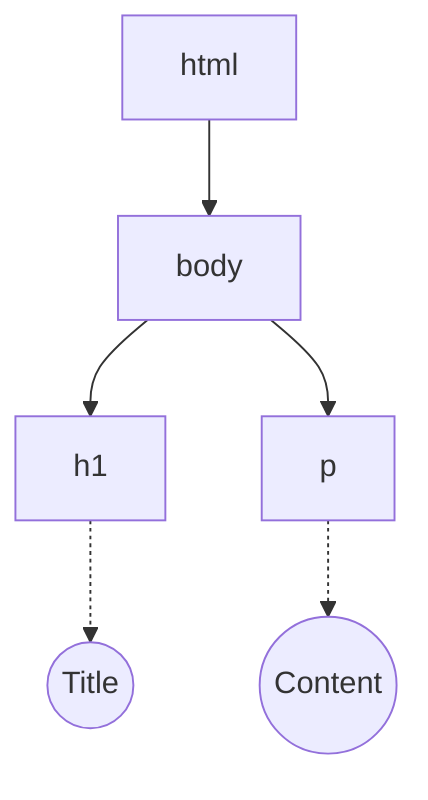
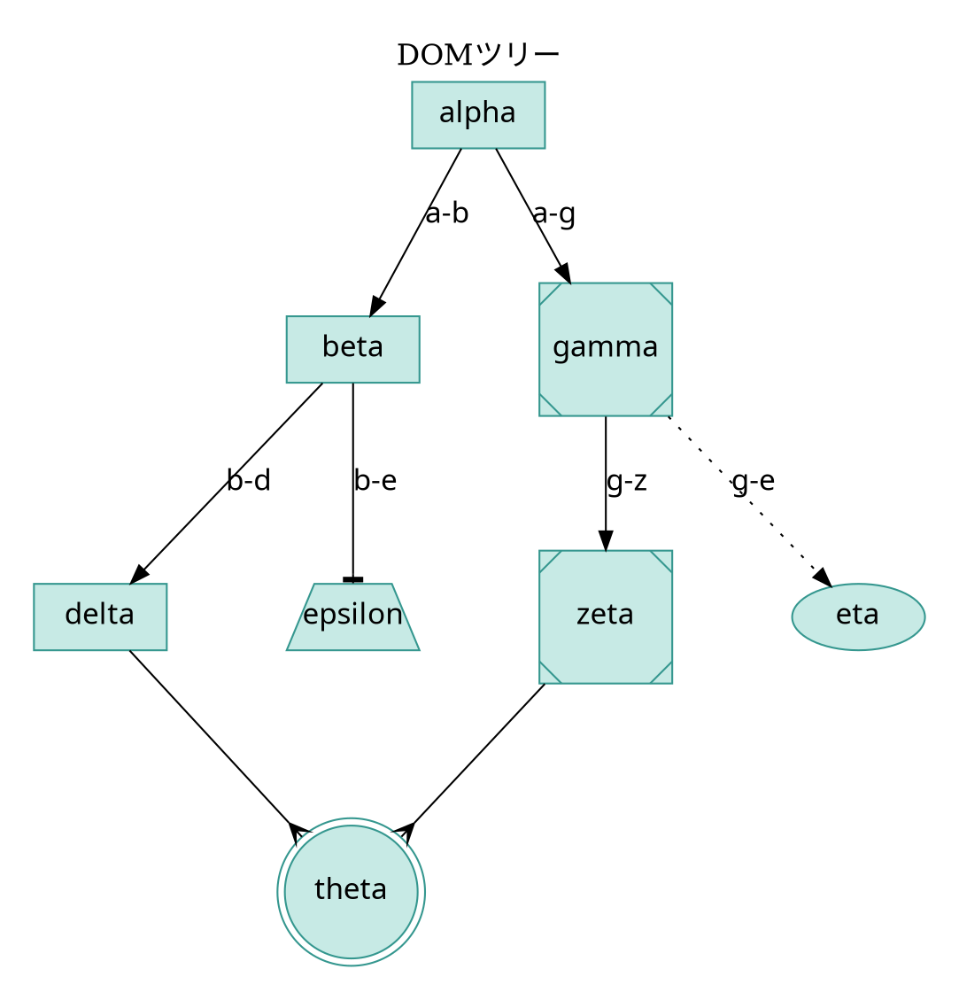

```mermaid
graph TD
    html --> body
    body --> h1
    h1 -.-> Title((Title))
    body --> p
    p -.-> Content((Content))
```

```dot
digraph dom_tree {
  graph [
    charset = "UTF-8";
    label = "DOMツリー",
    labelloc = "t",
    labeljust = "c",
    bgcolor = "#ffffff",
    fontcolor = black,
    fontsize = 16,
    style = "filled",
    rankdir = TB,
    margin = 0.2,
    splines = spline,
    ranksep = 1.0,
    nodesep = 0.9
  ];

  node [
    colorscheme = "brbg11"
    style = "solid,filled",
    fontsize = 16,
    fontcolor = black,
    fontname = "Migu 1M",
    color = 9,
    fillcolor = 7,
    fixedsize = true,
    height = 0.5,
    width = 1.0
  ];

  edge [
    style = solid,
    fontsize = 16,
    fontcolor = black,
    fontname = "Migu 1M",
    color = black,
    labelfloat = true,
    labeldistance = 2.5,
    labelangle = 70
  ];

  // node define
  alpha [shape = box];
  beta [shape = box];
  gamma [shape = Msquare];
  delta [shape = box];
  epsilon [shape = trapezium];
  zeta [shape = Msquare];
  eta;
  theta [shape = doublecircle];

  // edge define
  alpha -> beta [label = "a-b", arrowhead = normal];
  alpha -> gamma [label = "a-g"];
  beta -> delta [label = "b-d"];
  beta -> epsilon [label = "b-e", arrowhead = tee];
  gamma -> zeta [label = "g-z"];
  gamma -> eta [label = "g-e", style = dotted];
  delta -> theta [arrowhead = crow];
  zeta -> theta [arrowhead = crow];
}
```
