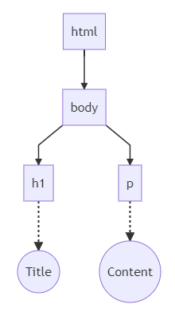

# 仮想DOM｜入門

## What's this?

ReactだとかVueだとかフロントエンド界隈の発展は目覚ましい

しかし、流行り廃りの激しいフレームワークばかり追いかけていては疲れてしまう

結局のところ、表面的な部分がどれほど変化していこうと、根っこの部分はそう大きくは変わらないのだから、一度しっかりと根本を理解することが大切だと考える

そのため、昨今のJavaScriptフレームワークの代表的な概念である**仮想DOM**について学ぶものとする

> 参考: https://kuroeveryday.blogspot.com/2018/11/how-to-create-virtual-dom-framework.html

***

## Introduction

### DOMとは
- ウェブ上の文書のコンテンツと構造からなるオブジェクトのデータ表現
- HTMLやXML文書のためのプログラミングインターフェイス

**DOM（Document Object Model）**
: 文書をプログラムにより操作するためのデータ表現のこと

#### DOMツリー
DOMはHTMLドキュメントをオブジェクトのツリーとして扱っている

これをDOMツリーと呼ぶ

```html
<html>
    <body>
        <h1>Title</h4>
        <p>Contents</p>
    </body>
</html>
```



---

### 仮想DOMとは
DOMツリーはブラウザがHTML文書を解釈しレンダリングするために持っている

これを無秩序に操作してしまうと、その都度HTMLを解釈し再レンダリングしなければならなくなるため、遅くなってしまう

そこで、いままでブラウザが持っていたDOMツリーを、JavaScriptのオブジェクトとして表現したのが**仮想DOM**である

仮想DOMによりレンダリングコストが下がる理由は、**変更が必要な個所のみDOMを書き換える**ことが可能になるからである

大まかには以下のように動作する

1. 現在のDOMの状態をコピーした仮想DOMツリーを用意
2. 何らかのアクションにより状態が変化する
3. 状態が変化した後の仮想DOMツリーを構築する
4. 変更前後の仮想DOMツリーを比較し、差分を検出する
5. 差分のみリアルDOMに反映 => ブラウザにレンダリングさせる

> なお、「仮想DOM」というAPIや機能があるわけではない
>
> あくまでも、状態変化の差分を検出して必要な個所のDOMのみを書き換えるために導入された概念に過ぎないということに注意する
>
> 最終的にリアルDOMを操作することに変わりはないため、差分が大きくなれば結局は遅くなってしまう

---

### 従来のDOM操作と仮想DOMの比較イメージ

- **従来のDOM操作**（バニラJSやjQueryなど）
    - 以下のようなHTMLのDOMを操作する場合
        ```html
        <div id="app">
            <h1>Title</h1>
            <p>Contents</p>
        </div>
        ```
    - バニラJSでDOMを書き換えると
        ```javascript
        const app = document.getElementById('app');
        app.innerHTML = app.innerHTML + '<p>DOM書き換え！</p>';
        ```
    - ブラウザは以下のように画面を更新する
        ```diff
        <div id="app">
        +   <h1>Title</h1>
        +   <p>Contents</p>
        +   <p>DOM書き換え！</p>
        </div>
        ```
- **仮想DOMによる操作**（ReactやVueなど）
    - 以下のようなHTMLのDOMを操作する場合
        ```html
        <div id="app">
            <h1>Title</h1>
            <p>Contents</p>
        </div>
        ```
    - 仮想DOMを構築
        ```javascript
        {
            nodeName: "div",
            attributes: {id: "app"},
            children: [
                {
                    nodeName: "h1",
                    children: ["Title"]
                },
                {
                    nodeName: "p",
                    children: ["Contents"]
                }
            ]
        }
        ```
    - 操作後の仮想DOMとの差分をとる
        ```diff
        {
            nodeName: "div",
            attributes: {id: "app"},
            children: [
                {
                    nodeName: "h1",
                    children: ["Title"]
                },
                {
                    nodeName: "p",
                    children: ["Contents"]
                },
        +       {
        +           nodeName: "p",
        +           children: ["DOM書き換え！"]
        +       },
            ]
        }
        ```
    - ブラウザは必要な部分のみ更新できる
        ```diff
        <div id="app">
            <h1>Title</h1>
            <p>Contents</p>
        +   <p>DOM書き換え！</p>
        </div>
        ```

***

## Setup

### Environment
- OS:
    - Windows 10
    - Ubuntu 18.04 LTS
- CLI:
    - nodejs: `10.15.3`
    - yarn (package manager): `1.15.2`

---

### Setup
仮想DOMフレームワークを実装するために TypeScript を使用する

また、TypeScript のモジュールハンドラーとして Webpack を採用する

```bash
# webpack, typescript をローカルインストール
$ yarn add -D webpack webpack-cli webpack-dev-server typescript ts-loader
```

- **webpack.config.js** (Webpackの設定)
    ```javascript
    const path = require('path');
    
    module.exports = {
      // 実行モード: develop => 開発, production => 本番
      // webpack4系以降はmodeを指定しないと警告が出る
      mode: 'development',
      // エントリーポイント
      entry: "./src/main.ts",
      // 出力設定
      output: {
        // バンドル後のファイル名
        filename: 'bundle.js',
        // 出力先のパス（※絶対パスで指定すること）
        path: path.join(__dirname, 'public')
      },
      // ビルドしたJavaScriptにsource-mapを書き出す
      devtool: 'inline-soruce-map',
      // モジュール設定
      module: {
        rules: [
          {
            // 拡張子 .ts の場合
            test: /\.ts$/,
            // ts-loaderを使って TypeScript をコンパイル
            use: "ts-loader"
          }
        ]
      },
      // import文で読み込むモジュールの設定
      resolve: {
        extensions: [".js", ".ts"], // .js, .ts をimport可能に
        modules: ["node_modules"] // node_modulesディレクトリからimport可能に
      },
      // 開発サーバー設定
      devServer: {
        // 起点ディレクトリを public/ に設定
        contentBase: path.join(__dirname, 'public'),
        // ポートを3000に設定
        port: 3000,
        // ブラウザを自動的に開く
        open: true
      }
    };
    ```
- **tsconfig.json** (TypeScriptのコンパイル設定)
    ```json
    {
      "compilerOptions": {
        "sourceMap": true,
        "target": "es5", // TypeScriptをECMAScript5にコンパイル
        "module": "es2015" // TypeScriptのモジュールは ES Modules として出力
      }
    }
    ```
- **package.json** (コマンドラインスクリプトの追加)
    ```json
    {
      // ～略～
      // `yarn start` コマンドで `webpack-dev-server` 実行可能に
      "scripts": {
        "start": "webpack-dev-server"
      }
    }
    ```

---

### Test run
簡単な TypeScript プログラムをコンパイル＆実行してみる

- **public/index.html** (webpack-dev-serverのエントリーポイント)
    ```html
    <!DOCTYPE html>
    <html lang="ja">
        <head>
            <meta charset="utf-8">
        </head>
        <body>
            <div id="root"></div>
            <!-- webpack によりバンドルされた bundle.js を読み込む -->
            <script src="./bundle.js"></script>
        </body>
    </html>
    ```
- **src/main.ts** (webpack + TypeScript のエントリーポイント)
    ```typescript
    class Person {
        fullName: string;

        constructor(
            public firstName: string,
            public middleInitial: string,
            public lastName: string)
        {
            this.fullName = firstName + " " + middleInitial + " " + lastName;
        }
    }

    const greeter = (person: Person) => 'Hello, ' + person.fullName;
    let user = new Person('Ameno', 'H.', 'Yoya');

    document.getElementById('root').innerHTML = greeter(user);
    ```

```bash
# TypeScriptコンパイル => Webpackでbundle.jsにパッキング => webpack-dev-serverでHTML表示
$ yarn start

# => localhost:3000
# => Hello, Ameno H. Yoya
```

***

## 仮想DOMフレームワーク制作

See [VirtualDOM.md](./VirtualDOM.md)
